# SwiftUI Tutorials

This repository contains projects completed while following [Apple's Swift Tutorials]([https://developer.apple.com/tutorials/develop-in-swift/welcome-to-develop-in-swift-tutorials](https://developer.apple.com/tutorials/swiftui)). These projects are designed to help learners explore the fundamentals of Swift and SwiftUI, showcasing practical implementations of key concepts.

<details close>
  <summary>Click to view iOS screenshots of the app..</summary>
  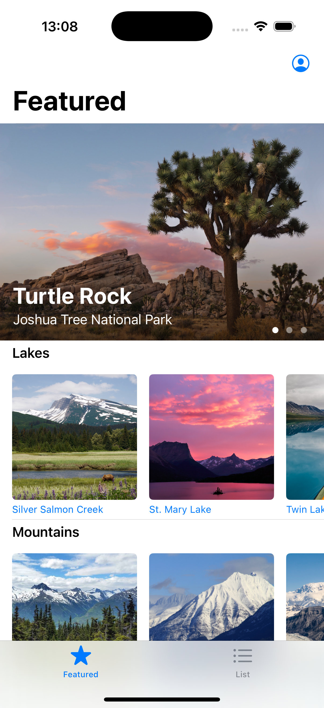 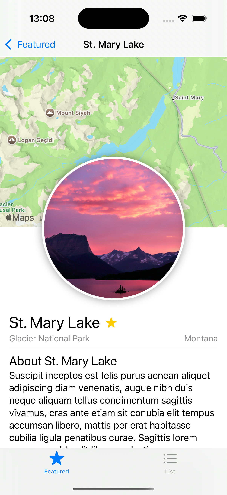 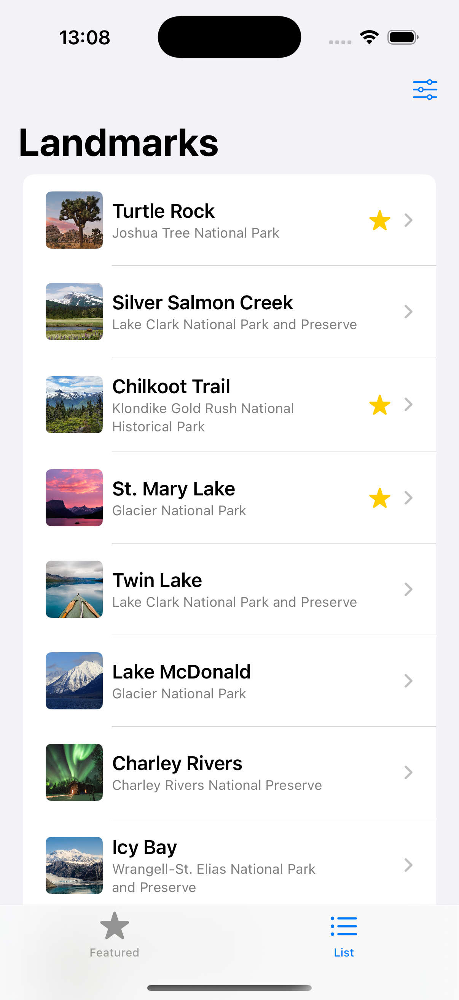 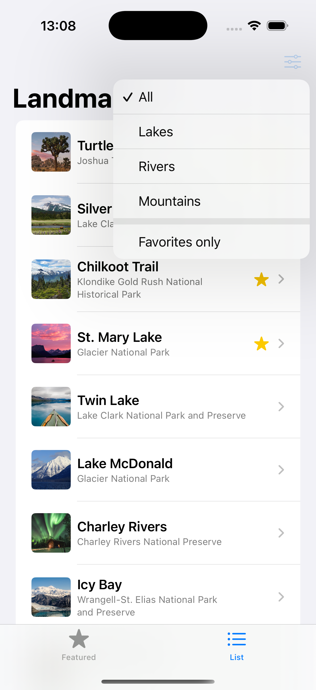
</details>

<details close>
  <summary>Click to view watchOS screenshots of the app.</summary>
  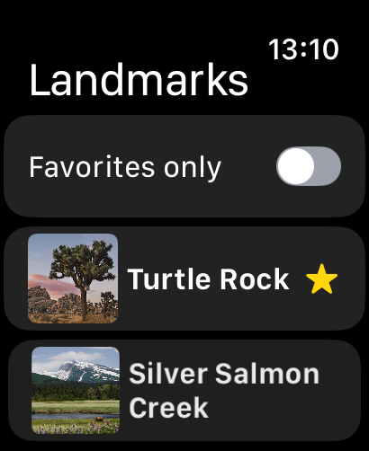 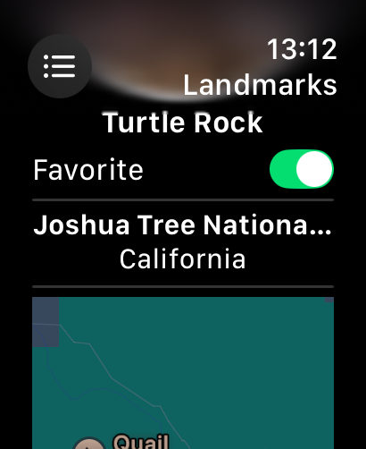 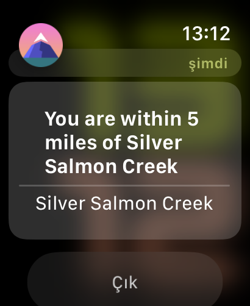 
</details>

<details close>
  <summary>Click to view macOS screenshots of the app.</summary>
  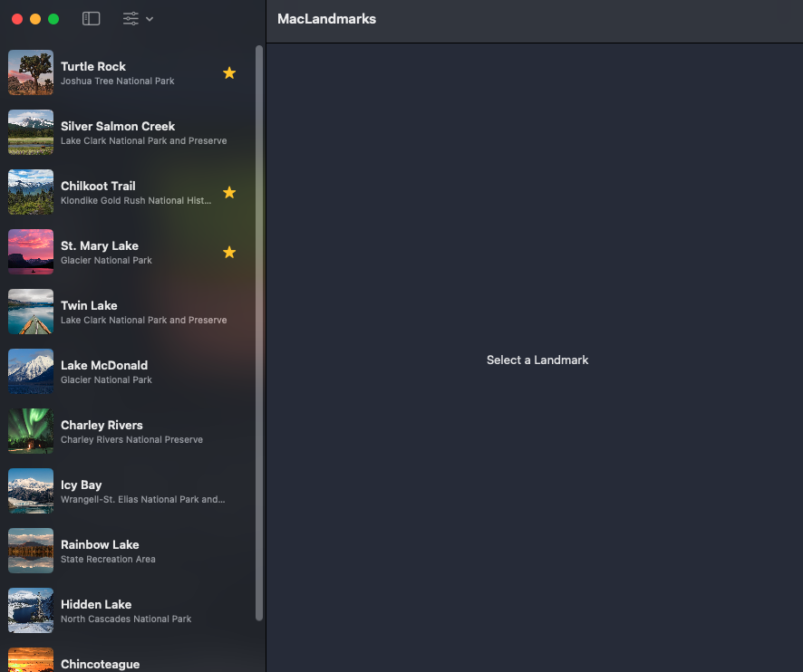 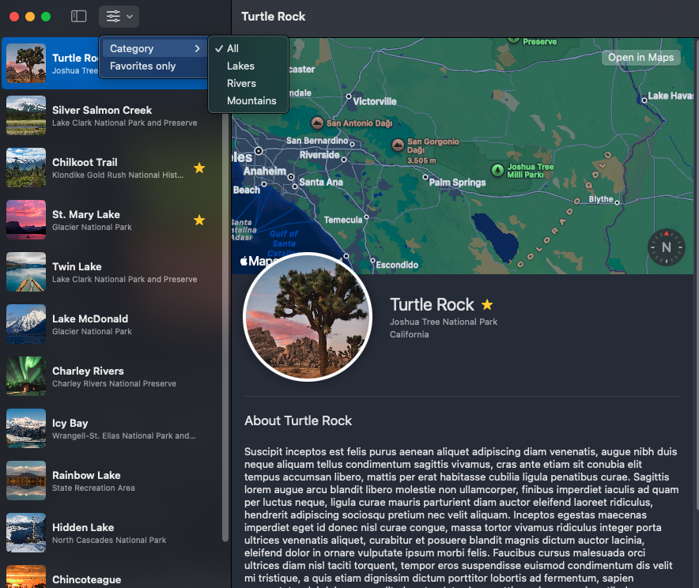 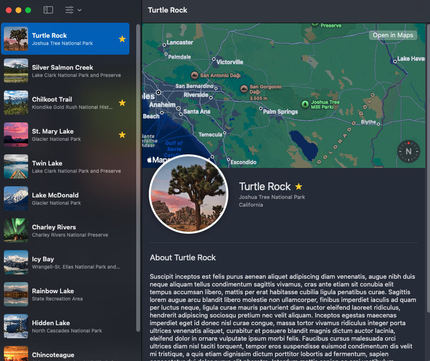 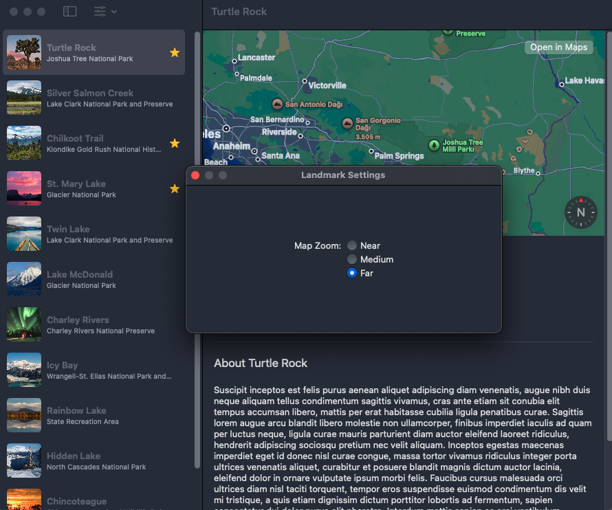 
</details>

### 📚 Tutorials Covered

The projects are based on the following topics from the tutorial series:

1. **SwiftUI essentials**
   - Creating and combining views
   - Building lists and navigation
   - Handling user input
2. **Drawing and animation**
   - Drawing paths and shapes
   - Animating views and transitions
3. **App design and layout**
   - Composing complex interfaces
   - Working with UI controls
3. **Framework integration**
   - Interfacing with UIKit
   - Creating a watchOS app
   - Creating a macOS app
  
### 🛠️ Tools and Technologies

- **Language**: Swift
- **Framework**: SwiftUI, UIKit
- **Xcode Version**: Xcode 16.1
- **Platform**: iOS, watchOS, macOS

### 📝 How to Run

1. Clone the repository:
   
   ```
   git clone https://github.com/ibrahimaykutbas/swiftUI-tutorial
   ```
   
2. Open the desired project folder in Xcode.
3. Build and run the app on your simulator or device.

> Don’t forget to set the target through the target selector to configure the environment you want to work in.
